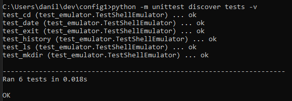

Этот проект реализует эмулятор языка оболочки для работы в виртуальной файловой системе (VFS), имитируя сеанс shell в UNIX-подобной операционной системе. Эмулятор предоставляет возможность работать с виртуальной файловой системой, не требуя её распаковки пользователем, и имеет графический интерфейс для ввода команд.

---

## Основные возможности

- **Навигация по виртуальной файловой системе (VFS):**
  - Перемещение между каталогами.
  - Просмотр содержимого папок.
- **Поддерживаемые команды:**
  1. **`ls`** — выводит список файлов и папок в текущем каталоге.
  2. **`cd`** — осуществляет переход в указанный каталог.
  3. **`mkdir`** — создаёт новую директорию в текущем каталоге.
  4. **`date`** — отображает текущую дату и время.
  5. **`history`** — выводит список выполненных команд в текущем сеансе.
  6. **`exit`** — завершает работу программы.
- **Логирование:**
  - Автоматическое сохранение всех команд и их результатов в лог-файл (формат YAML).
- **Графический интерфейс:**
  - Поле ввода для ввода команд.
  - Текстовое окно с прокруткой для отображения результатов.
- **Обработка виртуальной файловой системы:**
  - Принимает архив в формате ZIP и автоматически распаковывает его при запуске.

---
## Скриншоты

### Выполнение тестов

Ниже представлен скриншот, показывающий процесс успешного выполнения тестов для эмулятора:



## Конфигурация

Программа использует конфигурационный файл в формате **YAML**. Пример конфигурационного файла:

```yaml
hostname: "MyComputer"
vfs_path: "./resources/vfs.zip"
startup_script: "./resources/startup_script.sh"
